- Nama : Muhamad Nikmal Wahid
- kelas : TI 24 a3
- Pemrograman Web

# Pratikum 7: PHP Dasar 

## Intruksi Praktikum 
- Siapkan Text editor seperti VScode
- Buat file baru
- Buat struktur dasar dari dokumen HTML
- Mengikuti langkah-langkah yang tertera

# Installasi XAMPP dan menjalankan Web Server 
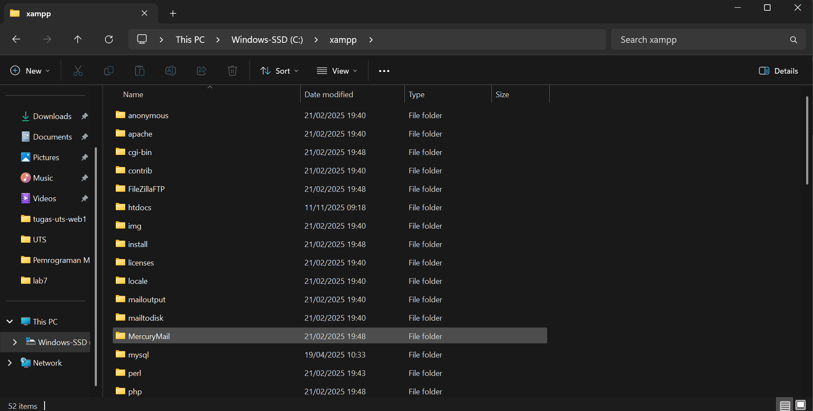
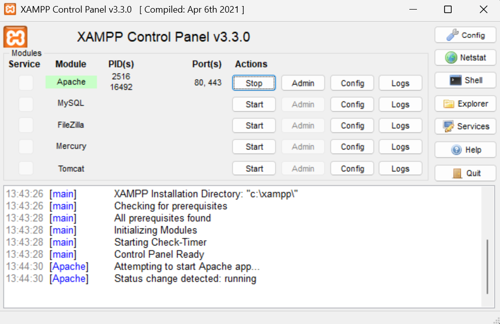 

# Membuat file PHP
Memulai PHP membuat folder lab7_php_dasar pada root directory web server (d:\xampp\htdocs). Kemudian untuk mengakses direktory tersebut pada web server dengan mengakses URL: http://localhost/lab7_php_dasar/

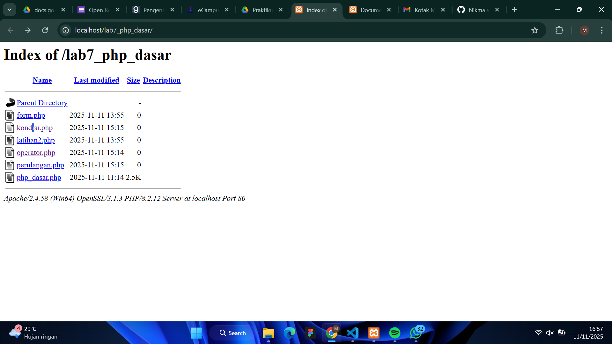

# PHP dasar 
Membuat file baru dengan nama file php_dasar.php dan untuk mengakses hasilnya bisa melalui URL: http://localhost/lab7_php_dasar/php_dasar.php
```
<!DOCTYPE html>
<html lang="en">
<head>
    <meta charset="UTF-8">
    <title>PHP dasar</title>
</head>
<body>
    <h1>Belajar PHP Dasar</h1>
    <?php
        echo "Hello World" ;
    ?>    

</body>
</html>
```
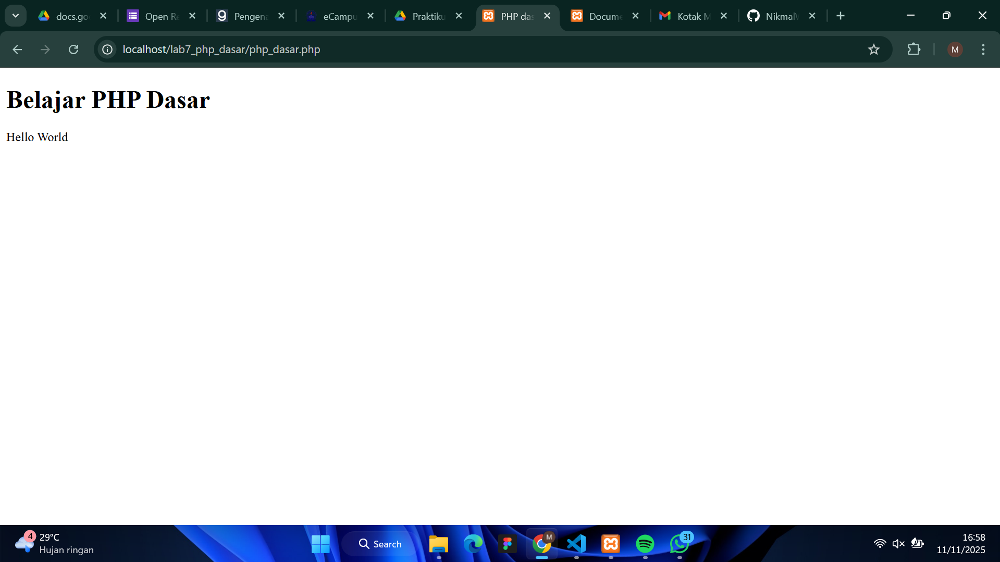

# Variable PHP 
Di bagian ini kita menambahkan variable pada program dan pada pratikum variabel terdapat Predefine Variable $_GET digunakan untuk mengambil data dari URL dalam bentuk query string dan untuk melihat hasil dari Predefine Variable $_GET kita bisa mengakses http://localhost/lab7_php_dasar/latihan2.php?nama=Agung
```
<!DOCTYPE html>
<html lang="en">
<head>
    <meta charset="UTF-8">
    <title>PHP dasar</title>
</head>
<body>  

    <h1>Menggunakan Variable</h1>
    <?php
    $nim = "0411500400" ;
    $nama = 'Abdullah' ;
    echo "NIM : " . $nim . "<br>" ;
    echo "Nama : $nama" ;
    ?>

    <h1>Predefine Variable</h1>
    <?php
    echo 'Selamat Datang ' . $_GET['nama'];
    ?>

</body>
</html>
```
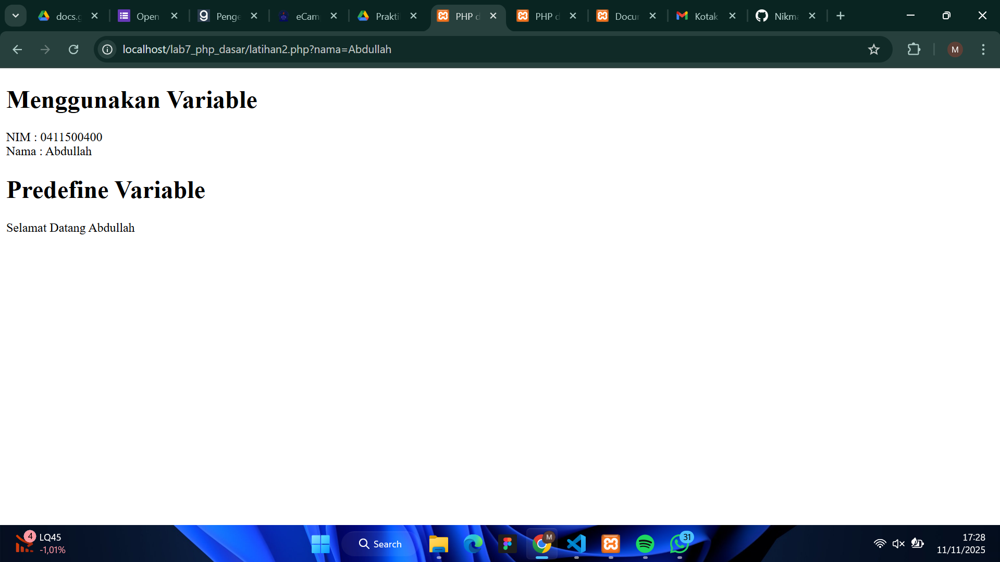

# Membuat Form Input 
Form ini dipakai buat mengambil data dari pengguna (misalnya nama) dan dikirim ke PHP untuk diproses. 

```
<!DOCTYPE html>
<html lang="en">
<head>
    <meta charset="UTF-8">
    <title>PHP dasar</title>
</head>
<body>

    <h2>Form Input</h2>
    <form method="post">
        <label>Nama: </label>
        <input type="text" name="nama">
        <input type="submit" value="kirim">
    </form>
    <?php
    echo 'Selamat Datang ' . $_POST['nama'];
    ?>

</body>
</html>
```

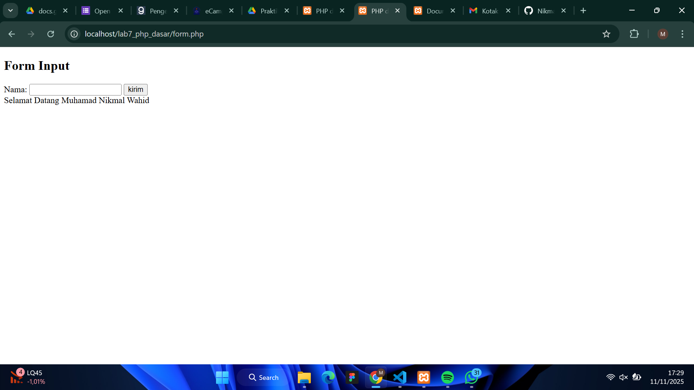

# Operator 
Operator digunakan untuk melakukan operasi perhitungan atau manipulasi nilai di dalam program.

```
    <?php
    $gaji = 1000000;
    $pajak = 0.1;
    $thp = $gaji - ($gaji * $pajak);

    echo "Gaji sebelum pajak = Rp. $gaji <br>";
    echo "Gaji yang dibawa pulang = Rp. $thp";
    ?>
```

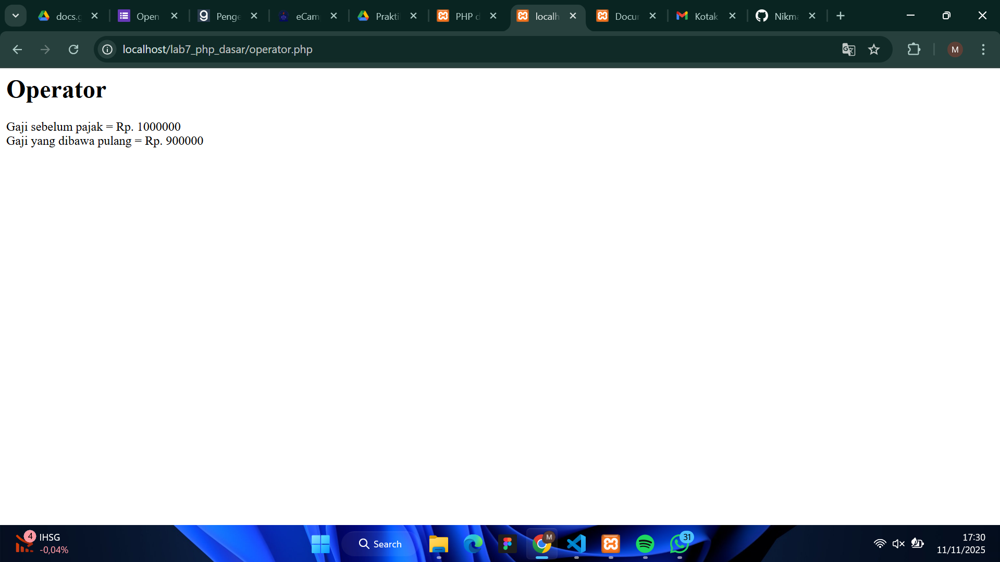

# Kondisi IF 
Kondisi if digunakan untuk mengecek suatu pernyataan (kondisi) dan menjalankan kode hanya jika kondisi tersebut benar (true).

```
    <?php
    $nama_hari = date("l");
    if ($nama_hari == "Sunday") {
        echo "Minggu";
    } elseif ($nama_hari == "Monday") {
        echo "Senin";
    } else {
        echo "Selasa";
    }
    ?>
```

# Kondisi Switch 
Switch digunakan untuk memeriksa banyak kemungkinan nilai dari satu variabel, mirip seperti if-elseif, tapi bentuknya lebih rapi dan mudah dibaca.
```
<?php
    $nama_hari = date("l"); 

    switch ($nama_hari) {
        case "Sunday":
            echo "Minggu";
            break;
        case "Monday":
            echo "Senin";
            break;
        case "Tuesday":
            echo "Selasa";
            break;
        default:
            echo "Sabtu";
    }
    ?>
```

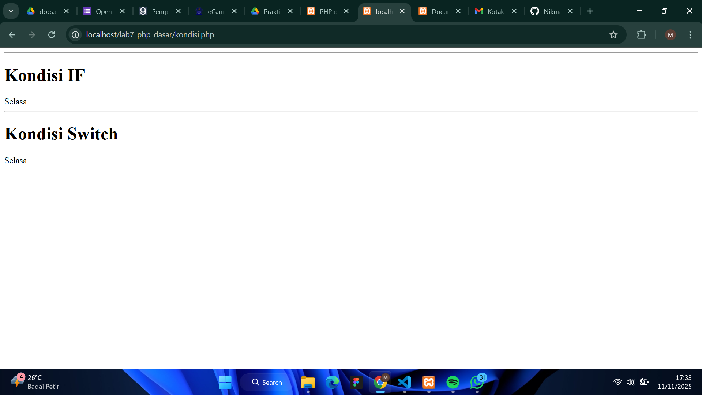

# Perulangan For 
For digunakan untuk mengulang eksekusi kode beberapa kali dengan jumlah perulangan yang sudah diketahui.

```
<?php
    echo "Perulangan 1 sampai 10 <br />";
    for ($i=1; $i<=10; $i++) {
        echo "Perulangan ke: " . $i . '<br />';
    }

    echo "Perulangan Menurun dari 10 ke 1 <br />";
    for ($i=10; $i>=1; $i--) {
        echo "Perulangan ke: " . $i . '<br />';
    }
    ?>
```

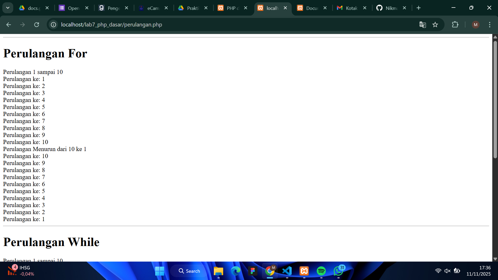

# Perulangan While dan Do While 
## Perulangan While 
Digunakan untuk mengulang kode selama kondisi bernilai benar (true). Kalau kondisi salah di awal, perulangan tidak akan dijalankan sama sekali
```
<?php
    echo "Perulangan 1 sampai 10 <br />"; 
    $i=1; 
    while ($i<=10) {
        echo "Perulangan ke: " . $i . '<br />'; 
        $i++;
        
    }
    ?>
```

## Perulangan Do While 
Mirip dengan while, tapi perintah dijalankan dulu baru dicek kondisinya.
Jadi, minimal satu kali perulangan pasti dijalankan.
```
<?php
    echo "Perulangan 1 sampai 10 <br />";
    $i=1;
    do {
        echo "Perulangan ke: " . $i . '<br />';
        $i++;
    } while ($i<=10);
    ?>
```

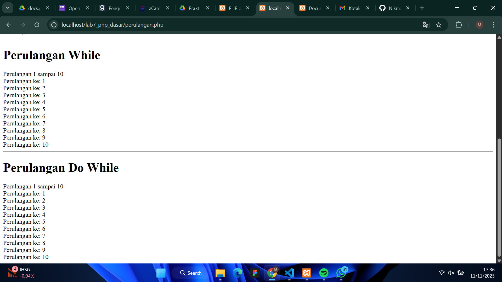

# Pertanyaan dan Tugas
Buatlah program PHP sederhana dengan menggunakan form input yang menampilkan nama, tanggal lahir dan pekerjaan. Kemudian tampilkan outputnya dengan menghitungumur berdasarkan inputan tanggal lahir. Dan pilihan pekerjaan dengan gaji yang berbeda-beda sesuai pilihan pekerjaan. 
Penjelasan Singkat: Setelah data dikirim melalui form, program akan memproses input yang diterima. Pertama, program menghitung umur pengguna berdasarkan tanggal lahir yang dimasukkan dengan menggunakan fungsi DateTime untuk mendapatkan selisih antara tanggal lahir dan tanggal saat ini. Selanjutnya, program menentukan besarnya gaji sesuai dengan pilihan pekerjaan yang dipilih oleh pengguna menggunakan struktur switch. Terakhir, hasil dari proses tersebut—berupa nama, umur, pekerjaan, dan gaji—akan ditampilkan secara langsung di bawah form pada halaman yang sama.

```
<!DOCTYPE html>
<html lang="en">
<head>
    <meta charset="UTF-8">
    <title>Form</title>
</head>
<body>
    <h2>Form Input</h2>
    <form method="post">
        <label>Nama:</label><br>
        <input type="text" name="nama" required><br><br>

        <label>Tanggal Lahir:</label><br>
        <input type="date" name="tgl_lahir" required><br><br>

        <label>Pekerjaan:</label><br>
        <select name="pekerjaan" required>
            <option value="">-- Pilih Pekerjaan --</option>
            <option value="Programmer">Programmer</option>
            <option value="Guru">Guru</option>
            <option value="Dokter">Dokter</option>
            <option value="Desainer">Desainer</option>
            <option value="Mahasiswa">Mahasiswa</option>
        </select><br><br>

        <input type="submit" value="Kirim">
    </form>

    <hr>

    <?php
    if ($_SERVER["REQUEST_METHOD"] == "POST") {
        $nama = $_POST['nama'];
        $tgl_lahir = $_POST['tgl_lahir'];
        $pekerjaan = $_POST['pekerjaan'];

        $tgl_lahir_obj = new DateTime($tgl_lahir);
        $sekarang = new DateTime();
        $umur = $sekarang->diff($tgl_lahir_obj)->y;

        switch ($pekerjaan) {
            case "Programmer":
                $gaji = 8000000;
                break;
            case "Guru":
                $gaji = 5000000;
                break;
            case "Dokter":
                $gaji = 10000000;
                break;
            case "Desainer":
                $gaji = 6000000;
                break;
            case "Mahasiswa":
                $gaji = 0;
                break;
            default:
                $gaji = 0;
                break;
        }

        echo "<h3>Hasil Data</h3>";
        echo "Nama: <strong>$nama</strong><br>";
        echo "Tanggal Lahir: <strong>$tgl_lahir</strong><br>";
        echo "Umur: <strong>$umur tahun</strong><br>";
        echo "Pekerjaan: <strong>$pekerjaan</strong><br>";
        echo "Gaji: <strong>Rp " . number_format($gaji, 0, ',', '.') . "</strong>";
    }
    ?>
</body>
</html>
```

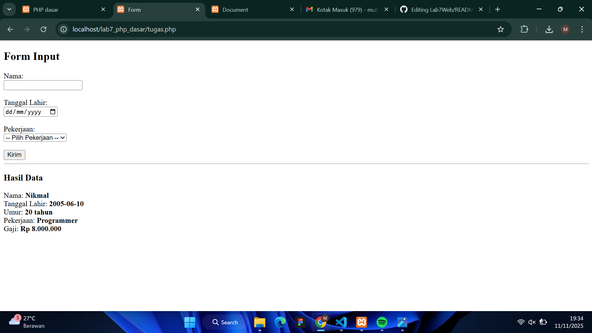


